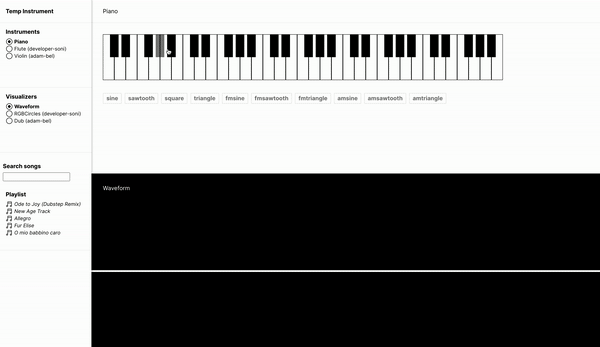

## Description
* Developed a real-time web music application to display visuals for instruments and music, using TypeScript
* Implemented React components and leveraged p5.js to create custom visuals and tone.js to add interactive instruments
* Created a node.js server to display music metadata on playtime from the SQL database
* Added search functionality for music from the database and used Redux to maintain the state
* For more, read [FINAL_PROJECT.md](./FINAL_PROJECT.md)

## Deployed on GH-Pages
https://developer-soni.github.io/Instrument-Visualizer \
(Server is not hosted, therefore Playlist Database is empty)

## Visualizer and Instrument in Action (No Sound in .gif)

# LamdbaVibe
Musical application. Get ready to shred.
## Client
The client contains the code which you will modify as part of the course. It constitutes the frontend (UI) portion of this web application.
In the `client` directory, you can run:
### `npm start`
Runs the app in the development mode.\
Open [http://localhost:3000](http://localhost:3000) to view it in the browser.
The page will reload if you make edits.\
You will also see any lint errors in the console.
### `npm run build`
Builds the app for production to the `build` folder.\
It correctly bundles React in production mode and optimizes the build for the best performance.
The build is minified and the filenames include the hashes.\
Your app is ready to be deployed!

See the section about [deployment](https://facebook.github.io/create-react-app/docs/deployment) for more information.

### `npm run prod`

This is a combination of `npm run build` and python3 `http.server`. This will start a new web server that hosts your app at [http://localhost:3002](http://localhost:3002). Rather than talking to your local environment, it will talk to a live, production server so you can jam with your group.

### Learn More about CRA (Create React App)

You can learn more in the [Create React App documentation](https://facebook.github.io/create-react-app/docs/getting-started).

To learn React, check out the [React documentation](https://reactjs.org/).

## Server

The server contains the backend code which. It is included here as a reference and as a pedagogical tool. Peruse the code to figure out how it works and how you ought to call the API. You will run a version of the server locally for testing purposes. Once you're ready to jam with your classmates, you will switch to talking to a production server. See `npm run prod` for details.

In the `server` directory, you can run:

### `npm start`

Runs the server in development mode.

The server will restart if you make edits.
You will also see errors in the console.
